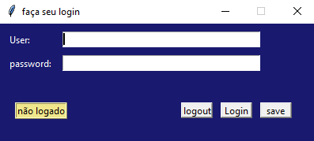
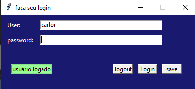
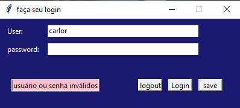

# sistema_login

Sistema de login simples feito em python com Sqlite3 e tkinter:
o sistema usa a base de dados user criada no SQliteStudio

pagina de login:

usuário logado:

usuário ou senha inválidos:

